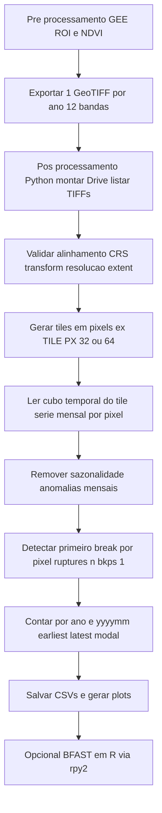

```mermaid
graph TD
  A[Pre processamento GEE ROI e NDVI] --> B[Exportar 1 GeoTIFF por ano 12 bandas]
  B --> C[Pos processamento Python montar Drive listar TIFFs]
  C --> D[Validar alinhamento CRS transform resolucao extent]
  D --> E[Gerar tiles em pixels ex TILE PX 32 ou 64]
  E --> F[Ler cubo temporal do tile serie mensal por pixel]
  F --> G[Remover sazonalidade anomalias mensais]
  G --> H[Detectar primeiro break por pixel ruptures n bkps 1]
  H --> I[Contar por ano e yyyymm earliest latest modal]
  I --> J[Salvar CSVs e gerar plots]
  J --> K[Opcional BFAST em R via rpy2]
```
