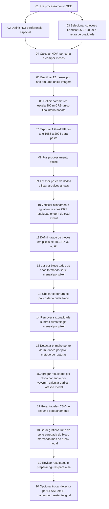

```mermaid
graph TD
  A00[01 Pre processamento GEE] --> A01[02 Definir ROI e referencia espacial]
  A00 --> A02[03 Selecionar colecoes Landsat L5 L7 L8 L9 e regra de qualidade]
  A01 --> A03[04 Calcular NDVI por cena e compor meses]
  A02 --> A03[04 Calcular NDVI por cena e compor meses]
  A03 --> A04[05 Empilhar 12 meses por ano em uma unica imagem]
  A04 --> A05[06 Definir parametros escala 300 m CRS unico tipo inteiro nodata]
  A05 --> A06[07 Exportar 1 GeoTIFF por ano 1985 a 2024 para pasta]
  A06 --> B00[08 Pos processamento offline]

  B00[08 Pos processamento offline] --> B01[09 Acessar pasta de dados e listar arquivos anuais]
  B01 --> B02[10 Verificar alinhamento igual entre anos CRS resolucao origem do pixel extent]
  B02 --> B03[11 Definir grade de blocos em pixels ex TILE PX 32 ou 64]
  B03 --> B04[12 Ler por bloco todos os anos formando serie mensal por pixel]
  B04 --> B05[13 Checar cobertura se pouco dado pular bloco]
  B05 --> B06[14 Remover sazonalidade subtrair climatologia mensal por pixel]
  B06 --> B07[15 Detectar primeiro ponto de mudanca por pixel metodo de rupturas]
  B07 --> B08[16 Agregar resultados por bloco por ano e por yyyymm calcular earliest latest e modal]
  B08 --> B09[17 Gerar tabelas CSV de resumo e detalhamento]
  B09 --> B10[18 Gerar graficos linha da serie agregada do bloco marcando mes do break modal]
  B10 --> B11[19 Revisar resultados e preparar figuras para aula]
  B11 -.-> C00[20 Opcional trocar detector por BFAST em R mantendo o restante igual]
```
